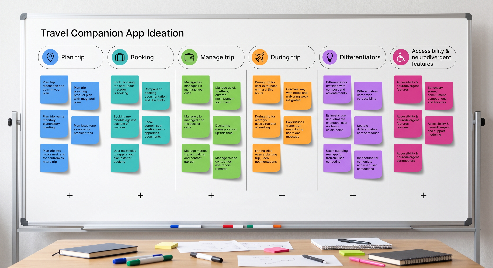

# Travel Companion by Nimosh

- **Team:** Muhammad Fuad bin Mohtar, Adam Daniel Ali bin Shamsul Azhar, Muhammad Fahmi Aiman bin Mohd Fauzi
- **Problem Statement:** Travel Planner
- **Video Presentation:** [Unlisted YouTube Link]
- **Presentation Slides:** https://canva.link/f9wfpelol49en3n

## 1. Project Overview

### The Problem

Planning and managing a trip today means juggling five or six disconnected apps — one for flights, one for hotels, one for currency conversion, a separate notes app for the itinerary, a banking app to track spend, and a translation app once you land. None of these tools talk to each other, so when something changes mid-trip — a flight delay, a weather shift, a budget overrun — the traveller is the one who has to notice it, work out the knock-on effects, and manually fix every downstream booking or plan themselves.

The stakeholders are budget-conscious and independent travellers who plan their own trips rather than using a travel agent, and who are frequently on the move without reliable time to sit down and replan. This also includes travellers with accessibility needs — such as OKU (Orang Kurang Upaya) travellers and neurodivergent travellers — who are especially underserved, since almost no mainstream travel app lets them filter or plan around mobility, sensory, or pacing needs.

Existing apps like **Google Travel** aggregate flights, hotels, and a basic itinerary view, but treat each trip as a static, one-time plan — it doesn't monitor the trip in real time, doesn't track spending, and doesn't adjust automatically when something disrupts the plan. It also has no accessibility-aware planning layer.

### Our Solution

Travel Companion is an AI-powered all-in-one travel app that plans, books, manages, and actively helps during a trip — not just before it. Unlike a booking aggregator, the AI layer connects every part of the journey: it builds the itinerary, tracks the budget, watches the flight status, and when something changes, it explains the change and adjusts the plan automatically instead of leaving the traveller to work it out. The core feature set:

- **Trip Planner & AI Itinerary** — enter dates, budget, and travel style; AI builds a day-by-day itinerary and re-optimises it around weather, opening hours, and disruptions
- **Booking Hub** — a single place to compare flights, hotels, transport, and activities
- **Budget Tracker, Receipt Scanner & Bill Splitter** — track spend by category, scan receipts to auto-log expenses, split group bills automatically
- **Live Flight & Travel Alerts** — real-time flight status, and alerts that cascade into itinerary changes (e.g. rescheduling an airport transfer after a delay)
- **AI Travel Assistant** — a chat-based assistant with context on the user's itinerary, budget, and bookings, answering questions like "can I still afford Harbin tomorrow?"
- **Visa/Document Checklist & Smart Packing List** — auto-generated based on destination, dates, and weather
- **Translation & Emergency tools** — on-the-ground language support and one-tap access to hospitals, embassies, and location sharing
- **Trip Readiness Score** — a single score (flight, budget, weather, documents, itinerary) that tells the user at a glance how prepared they are
- **Accessibility & neurodivergent-aware planning** — OKU/mobility filters, sensory-friendly pacing, and itineraries that build in rest breaks and quieter alternatives

## 2. Ideation & Process

### 2.1 Ideas We Considered

| Idea | Why it was dropped / kept |
|---|---|
| AI itinerary that reacts to real-time disruptions (Chosen) | Directly answers the core problem — plans that don't adjust themselves. This became our main differentiator. |
| Trip Readiness / Risk Score (Chosen) | Kept because it gives the AI's reasoning a single, visible output the user can trust at a glance, rather than a black box. |
| Accessibility & neurodivergent-aware planning (Chosen) | Kept because almost no competing app addresses this, and it turns "one more filter" into a genuinely underserved use case. |
| Become our own flight/hotel booking provider | Dropped — building and maintaining real booking infrastructure (payments, inventory, contracts with airlines/hotels) was out of scope for the timeline; aggregating existing providers gets the same user value faster. |
| Full social/group trip planning platform | Dropped — broadens scope significantly and dilutes the core "AI understands your whole trip" pitch; bill splitting alone covers the group-trip need we cared about. |

### 2.2 Ideation Boards

This board organises our brainstormed features into seven columns — Plan trip, Booking, Manage trip, During trip, Differentiators, Accessibility & neurodivergent, and a Parking lot for unsorted ideas — colour-coded by category. It shows how features were grouped by *where in the journey* they belong (before the trip, during booking, during travel) rather than by how technically complex they were, which is what led us to prioritise the AI itinerary and alerts system as the connective layer across all of them.

### 2.3 Mentor Consultation

| Date | Mentor | Feedback Received | What Was Changed |
|---|---|---|---|
| 06/09/2026 | Firdaus Abhar | Questioned whether trying to cover flights, budget, translation, and emergency tools in one app was too broad for the timeline, and suggested picking one flow to demo well rather than showing every feature shallowly. | Agreed in part — we kept the full feature map for the pitch, but narrowed the build-phase scope (Section 5) to one end-to-end demo flow: plan → itinerary → disruption → AI adjustment, rather than building every screen fully. |

## 3. Design & Prototype

**UI Prototype:** [(https://travel-app-two-tawny.vercel.app/)]

Key screens to embed/link (recommend 4–8):

1. **Home / Dashboard** — next trip summary with Trip Readiness score, quick actions (Flight, Budget, Plan), and AI assistant entry point.
2. **AI Trip Planner** — shows the AI visibly working (checking weather, comparing flights, analysing accommodation) before returning an estimated cost and readiness score.
3. **AI Itinerary** — day-by-day plan with a visible AI note explaining an adjustment it made (e.g. rerouting around weather, or adjusting pacing for accessibility needs).
4. **Budget Tracker** — total/spent/remaining breakdown by category with an AI spending insight.
5. **Live Flight** — real-time flight status card (gate, boarding time, terminal), including a delayed-state variant.
6. **Travel Alert** — a delay alert that cascades into a suggested itinerary change, demonstrating the app's core differentiator.
7. **Explore** — destination recommendation cards with accessibility tags (e.g. wheelchair-accessible transit, sensory-friendly hours).
8. **Profile — Travel Needs & Accessibility** — OKU/mobility, neurodivergent pacing, sensory sensitivity, and visual/hearing assistance toggles that feed the AI's recommendations.

## 4. What Makes It Different

- **The AI connects features to each other, not just to the user.** A flight delay doesn't just show a notification — it automatically checks the itinerary, flags the affected booking (e.g. an airport transfer), and proposes a fix. Most travel apps treat each feature (flights, budget, itinerary) as an island.
- **Trip Readiness Score.** A single, explainable number (not a black-box AI suggestion) that breaks down exactly what's dragging the trip's readiness down — e.g. "budget is tight because accommodation prices rose 18%."
- **Accessibility and neurodivergent-aware planning as a first-class feature**, not an accessibility settings afterthought — it changes what the AI actually recommends and how it paces the itinerary, not just how the UI looks.
- **AI explains itself.** Every automatic change (itinerary re-optimisation, transfer rescheduling) comes with a plain-language reason, so the user always understands why the app changed something rather than just seeing a diff.

## 5. Technical Architecture & Feasibility

### Tech stack

Tech stack
- **Frontend (mobile):** React Native via Expo — chosen for fast cross-platform iteration (test instantly on a physical phone through Expo Go) without needing separate iOS/Android codebases. Navigation via React Navigation (bottom tabs + native stack).
- **Frontend (web preview):** Same React Native codebase exported to web via react-native-web, deployed as a static site on Vercel — lets reviewers/mentors open the prototype instantly in a browser without installing anything.
- **Backend / AI:** Google Gemini API for the AI itinerary optimisation, the travel assistant chat, and the receipt scanner's image-to-data extraction — chosen because it handles both text reasoning (itinerary/budget logic) and vision input (photographed receipts) through one API, and our team has prior experience integrating it in another project. Constraint: free-tier rate limits mean the assistant and receipt scanner can't both be hammered in a live demo without hitting quota, so the demo script paces requests deliberately.
- **Database: Firebase (Firestore)** for storing trips, itineraries, bookings, and budget entries — chosen for its generous free tier, built-in authentication, and real-time sync (useful for the budget tracker updating live as expenses are added). Constraint: Firestore's NoSQL structure makes category-level budget aggregation (e.g. summing "Food" across a trip) more manual than a relational database would — we handle this with a denormalised per-category running total updated on write, rather than querying and summing on read.
- **APIs / services:** Booking Hub and Live Flight status use mock data for this prototype, since integrating real flight-status and hotel/flight aggregation (e.g. Amadeus or Skyscanner's API) requires paid-tier access and partner approval that's out of scope for the build phase — a production version would swap in a provider like Amadeus for bookings and AviationStack or FlightAware for live flight status. The Currency feature uses a free tier of exchangerate-api.com for live conversion rates, and Translation uses the Google Cloud Translation API, both chosen for generous free quotas suitable for a demo.
- **Hosting: Vercel (web prototype); Expo for native builds/distribution during development.

### Build plan & scope

For the build phase, we plan to implement:
1. The Home dashboard, AI Itinerary, and Budget Tracker screens with real (not mock) data, backed by [database choice].
2. A working AI itinerary generator calling [LLM API] with destination/dates/budget as input.
3. The Travel Alert → itinerary-adjustment flow as a scripted demo (using a simulated flight delay), since live flight-status APIs are out of scope for the timeline.
4. The Accessibility & neurodivergent preference toggles feeding into itinerary generation prompts.

Out of scope for this phase: real payment/booking integrations, a production-grade booking aggregator, and live third-party flight-status data — these are flagged as post-hackathon roadmap items.
